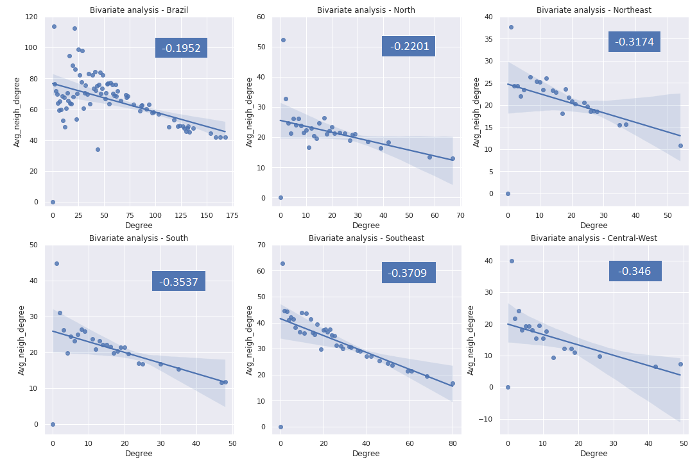
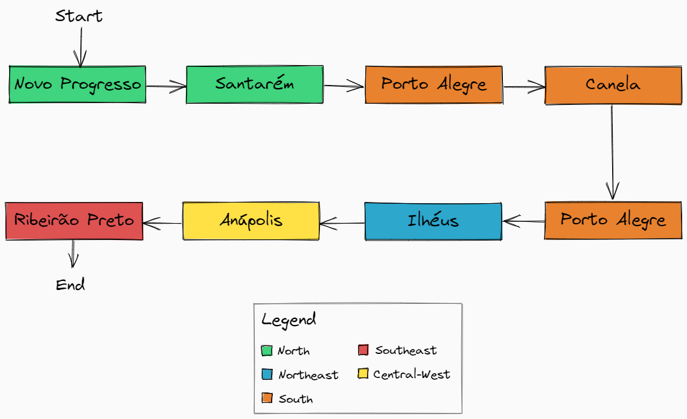

## Question 2

Perform a bivariate analysis between the degree of the vertex and the average number of neighbors.

#### Solution

First of all, it's important to understand the concept of assortativity. Assortativity is a metric that evaluates homophily, and this is a property that evaluates whether nodes of the same "type" have more connections, that is, most connections happen between similar nodes.

One way to check the assortativity is from the degree assortativity. It bases the assortativity by the degree of the nodes, and this coefficient can variate between -1 and 1, where:

*   -1: the network is extremely disassortativity, in other words, different elements connect with each other (in this case, nodes with high degree connect with nodes with low degree);
*    1: the network is extremely assortativity, in other words, similar elements connect with each other (in this case, nodes with high degree connect with nodes with high degree)

Understanding that, it was made an analysis of the degree assortativity using the function `degree_assortativity_coefficient` and making a visual analysis between the degree of the vertex and the average number of neighbors for the airports in Brazil and for the airports for each region of Brasil individualy. The image below shows the results obtained:

It is possible to notice that airports in Brazil, both nationally and regionally, are disassociative, since they all have negative degree assortativity coefficients. This means that airports with many connections do not necessarily connect only to airports with many connections.

## Question 4

Create a simulated scenario, where you want to take a trip with the following route:

*   City 1 (North) to city 2 (South)
*   City 2 (South) to city 3 (Northeast)
*   City 3 (Northeast) to city 4 (Central-West)
*   City 4 (Central-West) to city 5 (Southeast)

#### Solution

To create this simulated scenario, five cities were chosen, one from each region of Brazil, and they were related to their respective airports through the creation of a dictionary. Below are the cities and airports chosen for each Brazilian region:

Region       | Airport | City
:--------:   | :------:| :--------:
North        | SNNG    | Novo Progresso
Northeast    | SBIL    | Ilhéus
South        | SSCN    | Canela
Southeast    | SBRP    | Ribeirão Preto
Central-West | SBAN    | Anápolis

Then, for each path, functions `shortest_path` and `shortest_path_length` from `nxviz` library were used to calculate the shortest path and its length, respectively. Below, it's possible to check the image with the complete route taken from city 1 to city 5, whose route size is 7, and then the route taken in each path of the complete route is verified.

Table with each path:

Path                                           | Path length 
:-------------------------------------------- | :------:
City1 (Novo Progresso) -> City2 (Canela)       | 3   
City2 (Canela) -> City3 (Ilhéus)               | 2   
City3 (Ilhéus) -> City4 (Anápolis)             | 1    
City4 (Anápolis) -> City5 (Ribeirão Preto)     | 1    
