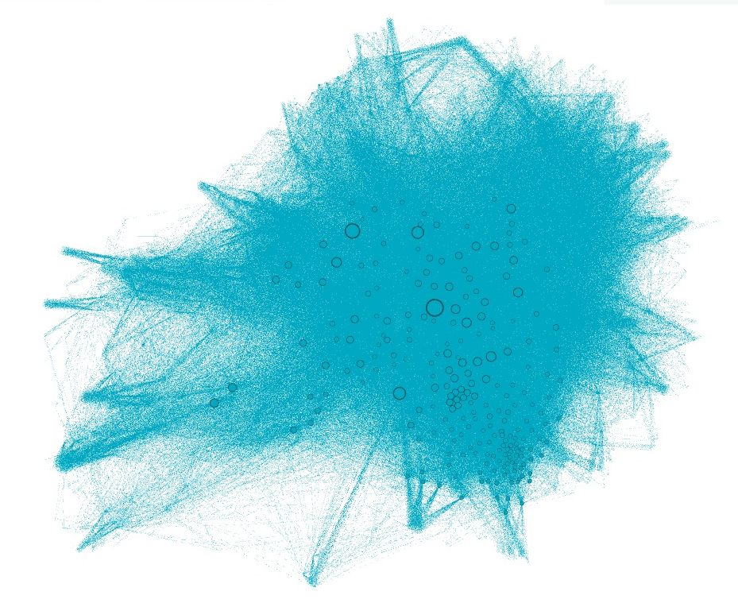
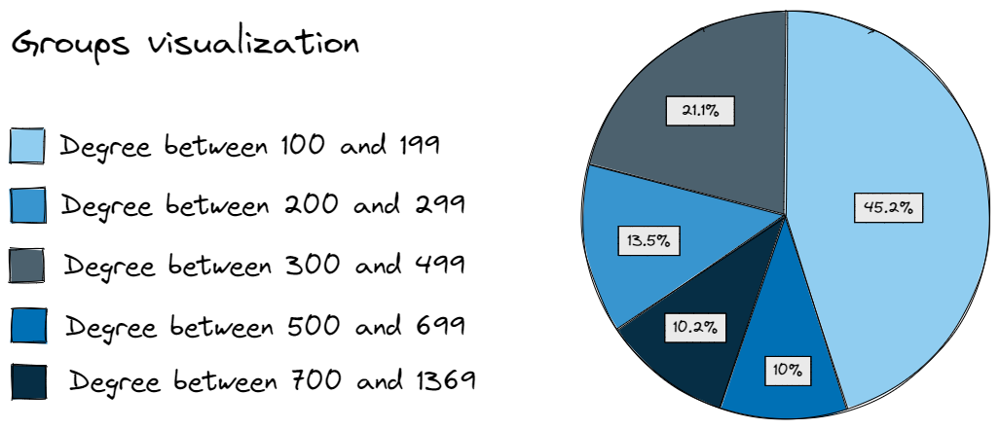
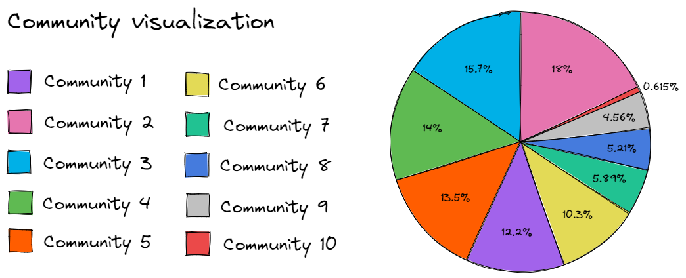
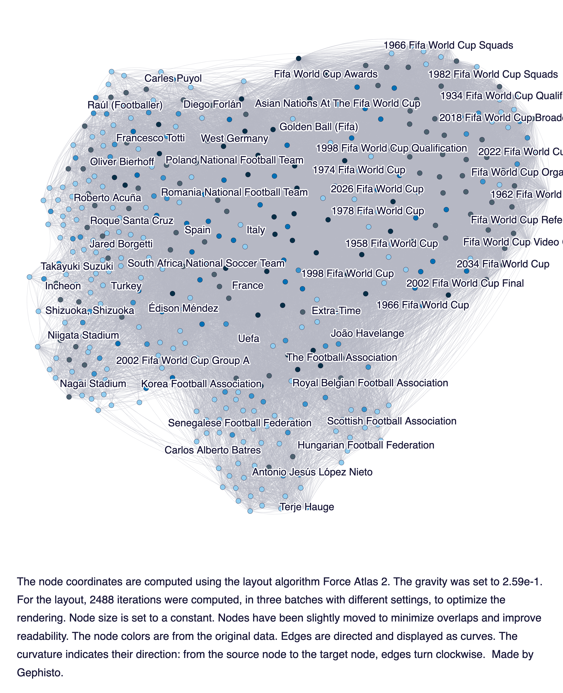
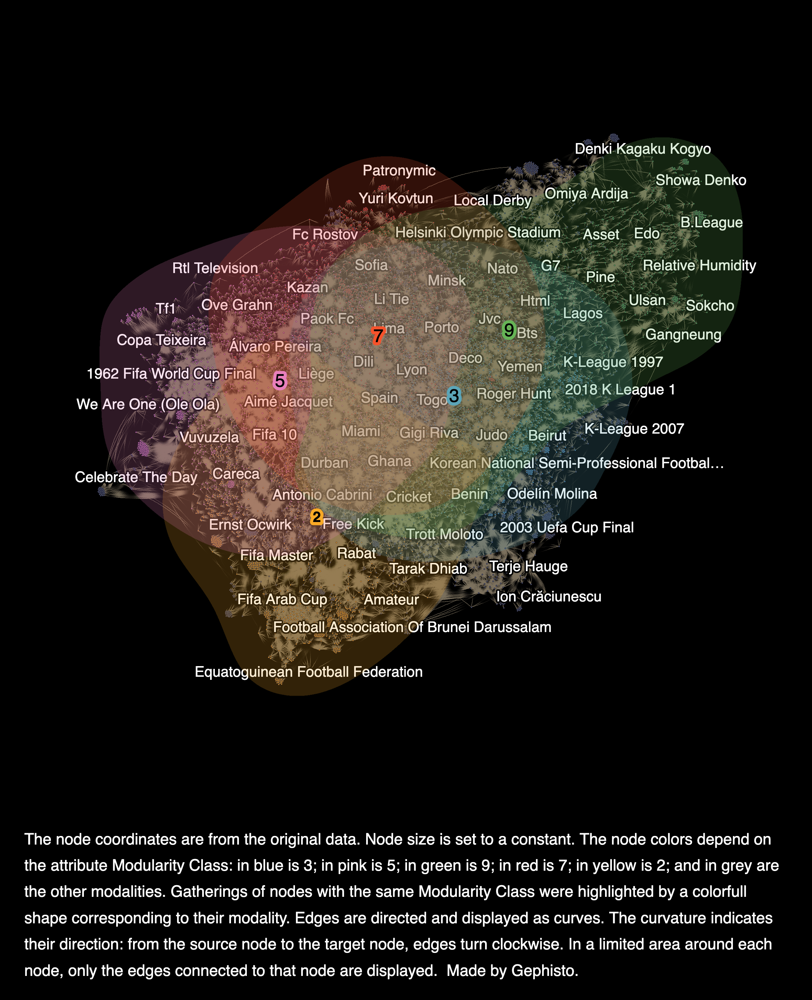

# Building a network with Wikipedia

This project aims to build a network from wikipedia page links, and perform many analyses in this network. For this, the `2022 FIFA World Cup` Wikipedia page was used as the initial node of the network. For this, some python libraries were used to help in this construction, such as the `networkx` and `wikipedia` libraries.


In this way, the network from Wikipedia links, starting with `2022 FIFA World Cup` was created and pre-processed, and then, it was analyzed the degree, closeness, betweenness and eigenvector centraility for this network; it was visualized the core and the shell; and finally, it was created a data pipeline for this network, including the steps of collecting data, cleaning data, and export the results of the final artifact.

It is important to highlight that this work was carried out in a group. This work was done by [Mariana Azevedo](https://github.com/marianabritoazevedo) [](https://github.com/marianabritoazevedo/data-structure-ii/tree/main/network_with_wikipedia),  [Morsinaldo Medeiros](https://github.com/Morsinaldo) [](https://github.com/Morsinaldo/data_structure_II/tree/main/network_with_wikipedia) and [Thaís Medeiros](https://github.com/thaisaraujo2000) [](https://github.com/thaisaraujo2000/algorithms_datastructure_ii/tree/main/week%2013)

You can check out our video about this project on [](https://www.youtube.com/watch?v=setncvImDgY)

## Data Pipeline

To start, we built a data pipeline to automate the process of extracting, pre-processing, reporting the results, and saving the artifact. Thus, our pipeline consists of three functions or steps, as shown in the figure below. 

<p align='center'>

</p>

Basically, the pipeline receives as parameter a SEED and a set of STOPS. That is, the seed is the page from which it will start collecting data, while STOPS is a list containing some pages on which it should stop and not collect quotes from pages that are quoted by those on the list. Thus, the pipeline receives the output of one function and passes it as a param to the next function.

For example, the `create_graph` step receives the SEED and STOPS and returns the raw graph. Next, the `preprocessing` step receives the raw graph and returns a processed graph for the `truncate` step to eliminate some duplicate nodes and contract them. In addition, the last step saves the final graph as a .graphml file and reports the results obtained. Finally, the `explore_network` step reports all the graphs with the metrics studied in class, as well as the .txt files containing the extractions performed and the processing performed on the graph.

All outputs from the pipeline can be reached in [pipeline_outputs](./pipeline_outputs/) folder.


## Pre-processing the network

The image below shows the process of cleaning data for the creation of this network. Initially, after collecting all the links with only one layer deep, there were 78588 nodes and 212551 edges. Then, two steps of pre-processing were made: eliminate duplicated nodes and eliminate nodes with degree = 1. After these steps, the final network had 27055 nodes and 161018 edges.

<p align="center">
  
</p>

## Exploring the network

### Most significant nodes

To visualize the most significant nodes of this network, it was calculated the `indegree` of each degree, which is, the number of connections entering the node, since this is a network directed.

The image below shows the top 10 of these most significant nodes, but it's possible to conclude that most of these nodes refer to past World Cup editions, to soccer-related terms, or even to some prominent teams, including the Brazilian team.

<p align="center">
  
</p>

### Degree, closeness, betweenness and eigenvector centrality

Before checking the results, it is important to understand what these concepts mean:

*  __Degree centrality__: checks the number of connections (neighbors) of a node according to the number of nodes in the network;
*  __Closeness centrality__: checks the average distance of a node to all other nodes. Thus, if the value of this metric is small for a certain node, it means that this node is farther from all other nodes in the network.
*  __Betweenness centrality__: checks the position of a node on the shortest path. That is, if I am analyzing `node i`, among all the shortest paths from `node j` to `node h`, how many of these paths does `node i` form part of?
*  __Eigenvector centrality__: checks the importance of a node based on the importance of its neighbors, that is, it checks whether a given node has important neighbors.

The `wikipedia.ipynb` notebook has the functions responsible for generating the graph images referring to the metrics mentioned above. However, as the network is very large, the [Gephi](https://gephi.org/) tool was used to generate a better visualization. Regarding this issue, to further improve this visualization, a filter was performed on the original network, leaving the nodes with a degree greater than or equal to 4. It is noteworthy that, in all visualizations, the lighter colors represent the lowest values, and the darkest colors represent the highest values, regardless of the metric being analyzed.

__Degree__

The first metric, referring to the degree, can be seen in the figure below. The figure shows only the labels for nodes with degrees above 1000, and it is possible to see that most of the nodes with high values for degrees refer to some previous edition of the world cup.

<p align="center">
  
</p>

__Closeness centrality__

Here, the metric referring to closeness centrality is visible. The labels refer to values above 0.5, realizing that these nodes, in general, are also editions of previous world cups, but Rté Television stands out quite perceptibly.

<p align="center">
  
</p>

__Betweenness centrality__

The third metric is betweenness centrality. It is worth noting that, as the search for links from a root page on Wikipedia had a maximum depth equal to 1, this means that this metric had many null values. In the image, we can see the labels for the nodes with a value above 0.002 for this metric, also highlighting terms referring to the world cup.

<p align="center">
  
</p>

__Eigenvector centrality__

Finally, regarding the eigenvector centrality, the labels refer to nodes with a value above 0.9 for this metric. It is possible to notice that, in general, there is a significant amount of nodes with high values of eigenvector centrality.

<p align="center">
  
</p>

### Centrality distributions

The centrality distributions will be analyzed according to two metrics: degree and closeness centrality, both previously seen in the previous topic.

For this, it is important to understand two important concepts of statistics for read the graphs:

* __PDF__: Probability Density Function. For this case, it will describe that approximately X% of the nodes have degree/closeness centrality equal to Y;
* __CDF__: Cumulative Density Function. For this case, it will describe that approximately X% of the nodes have degree/closeness centrality equal to or less than Y.

__Centrality distribution for degree__

First, the histogram was plotted for the analysis of the data referring to the degree of each node in the network, and as can be seen in the figure below, it appears that most nodes have a step value of less than 250.

<p align="center">
  
</p>

Then, this histogram was plotted with the PDF and CDF curves, as can be seen in the figure below, and it is possible to see that many nodes have a degree below 100. When checked in the CDF curve, it is inferred that it comes very close to 100% nodes with degree less than 100.

<p align="center">
  
</p>

Thus, in order to try to carry out a more detailed analysis in relation to degree, the network nodes were filtered, so that a subgraph was built only with nodes of degree 100 or higher. It can be noticed that the histogram has already become more distributed, as seen in the plots below, and that approximately 60% of the nodes (among the nodes with degree greater than 100) have a degree in the range of 100-200.

<p align="center">
  
</p>

Similarly, the same analysis was performed for the closeness centraliy metric. It was not necessary to filter the graph, as in the previous case, since the data were already well distributed, with the highest occurrences 0.006 and 0.01, as seen in the figure below.

<p align="center">
  
</p>

Then, plotting the histogram with the CDF and PDF functions, it is possible to see that approximately 90% of the network nodes have a closeness centrality value equal to or less than 0.008.

<p align="center">
  
</p>

After that, it was made a plot which to compare the metrics. On the diagonal, it's possible to notice that the distributions have a long tail to the right side, with a positive symmetry, where many nodes have a small degree, and few nodes have a neighborhood of little importance. Also, the eigenvector and closeness have an exponential trend, i. e., as one increases, the other increases as well. However, there is a limitation in this trend, in that after a certain point, this is no longer a valid thing.

<p align="center">
  
</p>

### Core Decomposition

Core decomposition is relacioned to the cores hierarchy, in which the nodes are deleted recursively in a network. For this, there are two metrics: k-core and k-shell. A k-core refers to a subnet in which all nodes have at least k neighbors. The nodes eliminated to reach a k-core are called shell.

By analyzing the network, it was possible to see that it has 106 layers. Therefore, in the figure below it is possible to see that the maximum k-core is 168, indicated with blue color, and the k-shell is 123, represented with red color.

<p align="center">
  
</p>


## Network Visualization

It is also possible to get other ways to visualize our network through tools such as [Gephi](https://gephi.org/), with the `SigmaExporter` plugin, [Retina](https://ouestware.gitlab.io/retina/beta/), and [Gephisto](https://jacomyma.github.io/gephisto/). The productions of these tools will be explored separately for each tool.

### Visualization using Gephi and SigmaExporter

#### Visualization 1: degree

Initially, it was thought to perform an interactive visualization based on the degree of the network nodes. For this, using the `pandas` library, the data was divided according to the degree into 5 different groups, as it shows below. More details about that data processing can be check in the notebook `Processing_data_gephi.ipynb`, and it is important to emphasize that this network was filtered and has nodes with step greater than or equal to 4.

*  Group 1: $4 \leq degree \leq 5 $
*  Group 2: $6 \leq degree \leq 7 $
*  Group 3: $8 \leq degree \leq 11 $
*  Group 4: $12 \leq degree \leq 20 $
*  Group 5: $21 \leq degree \leq 1369 $

After performing this division on the data, a new dataset was created, imported into gephi, and thus produced the final visualization. However, after doing all this process, the final view was not interesting, as can be seen in the image below. Despite not being in greater numbers, the nodes in group 5 (color blue) are dominant in terms of the number of edges, producing a view that is difficult for the other groups to understand.

<p align='center'>

</p>

In this way, it was decided to make a second visualization referring to the degree of the network nodes, performing an even greater filtering to preserve only the nodes with a higher value referring to the degree.

#### Visualization 2: degree (improved)

---

:information_source: Repository with more details [here](https://github.com/marianabritoazevedo/gephi-visualization-degree)

:mag_right: Interactive page [here](https://marianabritoazevedo.github.io/gephi-visualization-degree/network/)

---

To make a better visualization using the degree metric, a filtering was made in the network, keeping only the nodes with degree greater than or equal to 100, and thus, the final network had 460 nodes.

Then, using the `pandas` library, the data was divided according to the degree into 5 different groups. More details about that data processing can be check in the notebook `Processing_data_gephi.ipynb`.

*  Group 1: $100 \leq degree \leq 199 $
*  Group 2: $200 \leq degree \leq 299 $
*  Group 3: $300 \leq degree \leq 499 $
*  Group 4: $500 \leq degree \leq 699 $
*  Group 5: $700 \leq degree \leq 1369 $

After performing this division on the data, a new dataset was created, imported into gephi, and thus produced the final visualization. The image below shows the colors chosen to represent each group, as well as the percentage of each. It is noticed that almost half of the nodes in this network belong to the first group, with degrees between 100 and 199.

<p align='center'>

</p>

#### Visualization 3: community

---

:information_source: Repository with more details [here](https://github.com/marianabritoazevedo/gephi-visualization-community)

:mag_right: Interactive page [here](https://marianabritoazevedo.github.io/gephi-visualization-community/network/)

---

To explore another metric, it was used another metric from Gephi tool. In the `statistics` tab of the gephi software, the `modularity` metric was chosen, within the `community detection` group, to detect communities in the final network. After this execution, 10 different communities were detected in the network.

With this information, the network was styled so that each community was painted in a different color, allowing easy identification, and then the final visualization was produced. The image below has a caption explaining which color is related to which community.

<p align='center'>

</p>

### Visualization using Gephisto

Gephisto is an online graph visualization tool that is very straightforward, i.e. you don't need any configuration or in-depth knowledge to visualize the network. All you need to do is upload the file to the site and it generates the visualization.

#### Visualization 1

The first visualization was done using the file [degrees.graphml](./graph_files) in which it divides the network according to the degree of the nodes. Also, to improve the visualization, only nodes with a degree greater than or equal to 100 were kept. The image below shows the result of the visualization.

<p align='center'>

</p>

From the graph above, you can see that the network generated by our seed is strongly connected with the World Cup pages from previous years, as well as some famous players, some countries and other soccer leagues. Thus, it is possible to notice the pages that are most related to the 2022 world cup page. This is interesting to extract several insights, such as, for example: Are the players of the national teams that are playing in the cup predominantly from the mentioned soccer leagues?; Are the most quoted players still playing? And so on.

#### Visualization 2

The second visualization was done using the file [community.graphml](./graph_files) in which it divides the network according to the community of the nodes. Also, to improve the visualization, only nodes with a degree greater than or equal to 4 were kept. The image below shows the result of the visualization.

<p align='center'>

</p>

In the graph divided by communities, it is possible to see the prominence of nodes containing, mainly, the name of players, the name of teams, some newspapers, among others. Thus, it is possible to extract insights similar to those mentioned above, as well as others such as: The highlighted players played in which teams of the leagues also mentioned? Have the highlighted cities hosted or will host a World Cup? And so on.

### Visualization using Retina
Retina is a tool developed that you to visualize the network in a more interactive way. The tool is very simple to use, you just need to upload the file and it generates the visualization. For this, the file [community_metrics.graphml](./graph_files) was used.
You can watch the [](https://www.loom.com/share/f1086e48e7764d9ba50e6928d5bfe3b2) to see details about the visualization.

## How to execute

To run this project with your `SEED`, you only need to change this parameter and the stop lists in the [Data Pipeline Notebook](data_pipeline.ipynb), as shown below.

```python
# setup seed and stops
SEED = "2022 FIFA World Cup".title()
STOPS = ("FIFA",
         "FIFA 2022",
         "FIFA World Cup",
         "2022 tournament")
```

After that, just run all the cells and the pipeline will return all the results and the .graphml file to you.

## References
[Ivanovitch's Repository](https://github.com/ivanovitchm/datastructure)

[Vladimir Batagelj and Matjaz Zaversnik. An o (m) algorithm for cores
decomposition of networks](https://arxiv.org/pdf/cs/0310049.pdf)
