# Building a network with wikipedia

This project aims to build a network from wikipedia page links, and perform many analyses in this network. For this, the `2022 FIFA World Cup` wikipedia page was used as the initial node of the network. For this, some python libraries were used to help in this construction, such as the `networkx` and `wikipedia` libraries.

In this way, the network from wikipedia links, starting with `2022 FIFA World Cup` was created and pre-processed, and then, it was analyzed the degree, closeness, betweenness and eigenvector centraility for this network; it was visualized the core and the shell; and finally, it was created a data pipeline for this network, including the steps of collecting data, cleaning data, and export the results of the final artifact.

It is important to highlight that this work was carried out in a group. This work was done by me, [Mariana Azevedo](https://github.com/marianabritoazevedo) ,  [Morsinaldo Medeiros](https://github.com/Morsinaldo)  and [Thaís Medeiros](https://github.com/thaisaraujo2000?tab=repositories) 

## Data Pipeline

To start, we built a data pipeline to automate the process of extracting, pre-processing, reporting the results, and saving the artifact. Thus, our pipeline consists of three functions or steps, as shown in the figure below. 

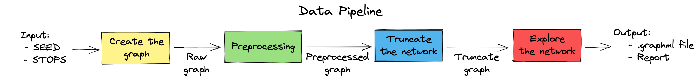

Basically, the pipeline receives as parameter a SEED and a set of STOPS. That is, the seed is the page from which it will start collecting data, while STOPS is a list containing some pages on which it should stop and not collect quotes from pages that are quoted by those on the list. Thus, the pipeline receives the output of one function and passes it as a param to the next function.

For example, the `create_graph` step receives the SEED and STOPS and returns the raw graph. Next, the `preprocessing` step receives the raw graph and returns a processed graph for the `truncate` step to eliminate some duplicate nodes and contract them. In addition, the last step saves the final graph as a .graphml file and reports the results obtained. Finally, the `explore_network` step reports all the graphs with the metrics studied in class, as well as the .txt files containing the extractions performed and the processing performed on the graph.

All outputs from the pipeline can be reached in [pipeline_outputs](./pipeline_outputs/) folder.

## Pre-processing the network

The image below shows the process of cleaning data for the creation of this network. Initially, after collecting all the links with only one layer deep, there were 78588 nodes and 212551 edges. Then, two steps of pre-processing were made: eliminate duplicated nodes and eliminate nodes with degree = 1. After these steps, the final network had 27055 nodes and 161018 edges.

  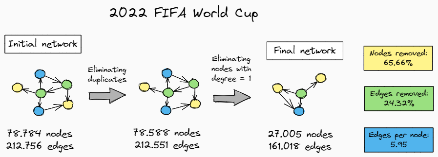

## Exploring the network

### Most significant nodes

To visualize the most significant nodes of this network, it was calculated the `indegree` of each degree, which is, the number of connections entering the node, since this is a network directed.

The image below shows the top 10 of these most significant nodes, but it's possible to conclude that most of these nodes refer to past World Cup editions, to soccer-related terms, or even to some prominent teams, including the Brazilian team.

  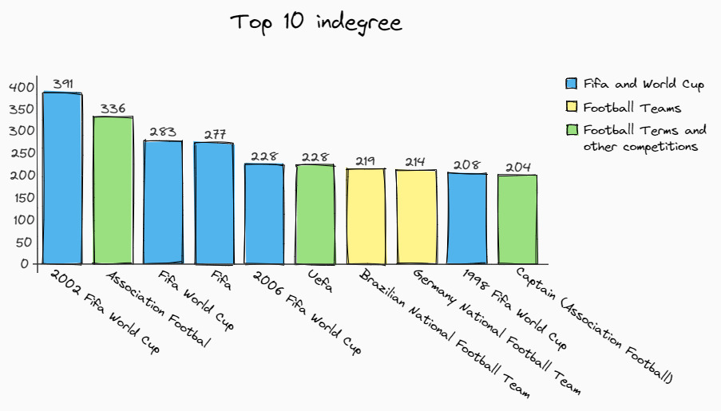

### Degree, closeness, betweenness and eigenvector centrality

Before checking the results, it is important to understand what these concepts mean:

*  __Degree centrality__: checks the number of connections (neighbors) of a node according to the number of nodes in the network;
*  __Closeness centrality__: checks the average distance of a node to all other nodes. Thus, if the value of this metric is small for a certain node, it means that this node is farther from all other nodes in the network.
*  __Betweenness centrality__: checks the position of a node on the shortest path. That is, if I am analyzing `node i`, among all the shortest paths from `node j` to `node h`, how many of these paths does `node i` form part of?
*  __Eigenvector centrality__: checks the importance of a node based on the importance of its neighbors, that is, it checks whether a given node has important neighbors.

The `wikipedia.ipynb` notebook has the functions responsible for generating the graph images referring to the metrics mentioned above. However, as the network is very large, the [Gephi](https://gephi.org/) tool was used to generate a better visualization. Regarding this issue, to further improve this visualization, a filter was performed on the original network, leaving the nodes with a degree greater than or equal to 4. It is noteworthy that, in all visualizations, the lighter colors represent the lowest values, and the darkest colors represent the highest values, regardless of the metric being analyzed.

__Degree__

The first metric, referring to the degree, can be seen in the figure below. The figure shows only the labels for nodes with degrees above 1000, and it is possible to see that most of the nodes with high values for degrees refer to some previous edition of the world cup.

  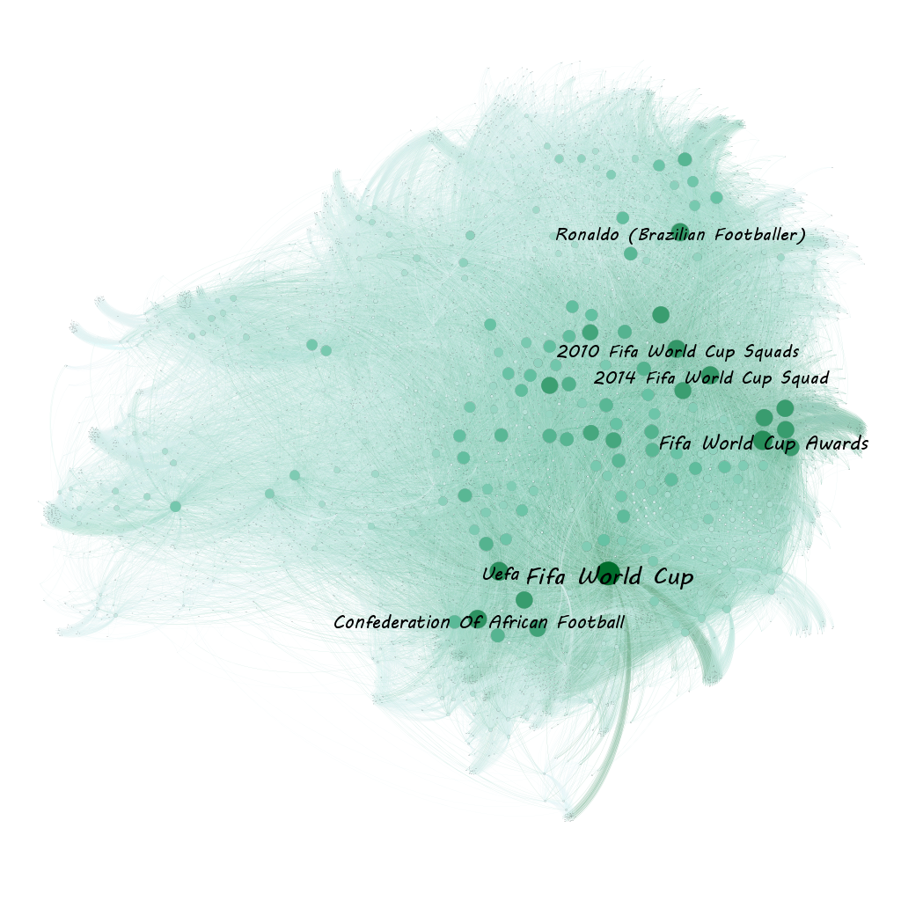

__Closeness centrality__

Here, the metric referring to closeness centrality is visible. The labels refer to values above 0.5, realizing that these nodes, in general, are also editions of previous world cups, but Rté Television stands out quite perceptibly.

  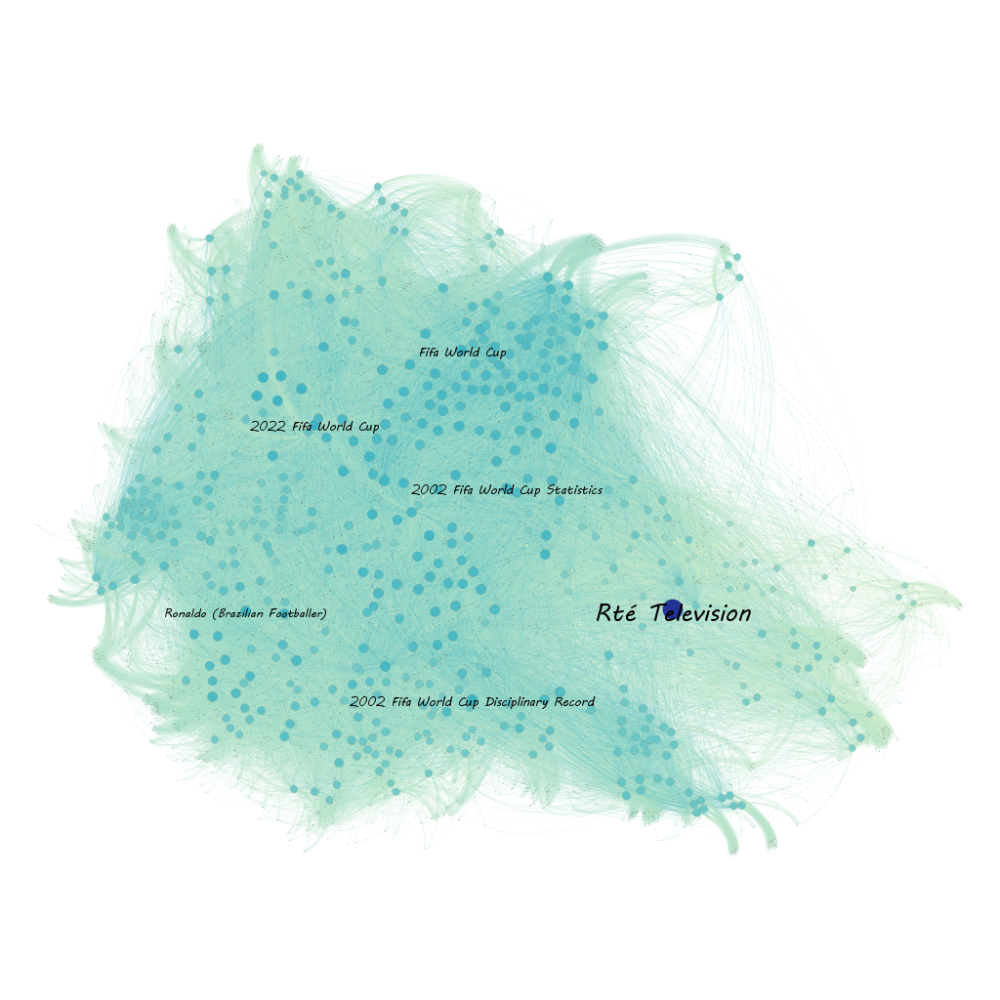

__Betweenness centrality__

The third metric is betweenness centrality. It is worth noting that, as the search for links from a root page on Wikipedia had a maximum depth equal to 1, this means that this metric had many null values. In the image, we can see the labels for the nodes with a value above 0.002 for this metric, also highlighting terms referring to the world cup.

  

__Eigenvector centrality__

Finally, regarding the eigenvector centrality, the labels refer to nodes with a value above 0.9 for this metric. It is possible to notice that, in general, there is a significant amount of nodes with high values of eigenvector centrality.

  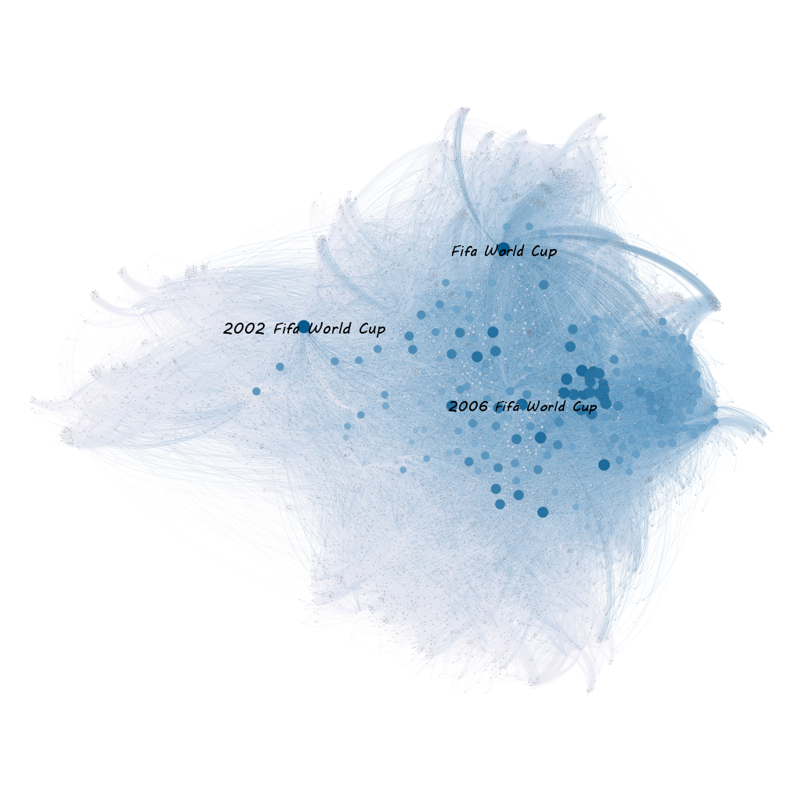

### Centrality distributions

The centrality distributions will be analyzed according to two metrics: degree and closeness centrality, both previously seen in the previous topic.

For this, it is important to understand two important concepts of statistics for read the graphs:

* __PDF__: Probability Density Function. For this case, it will describe that approximately X% of the nodes have degree/closeness centrality equal to Y;
* __CDF__: Cumulative Density Function. For this case, it will describe that approximately X% of the nodes have degree/closeness centrality equal to or less than Y.

__Centrality distribution for degree__

First, the histogram was plotted for the analysis of the data referring to the degree of each node in the network, and as can be seen in the figure below, it appears that most nodes have a step value of less than 250.

  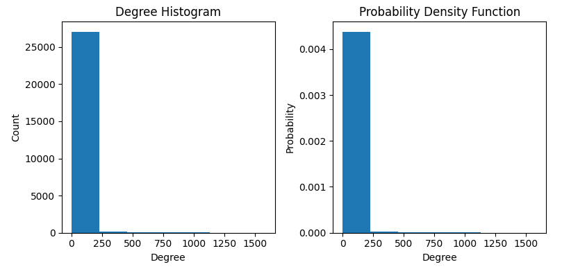

Then, this histogram was plotted with the PDF and CDF curves, as can be seen in the figure below, and it is possible to see that many nodes have a degree below 100. When checked in the CDF curve, it is inferred that it comes very close to 100% nodes with degree less than 100.

  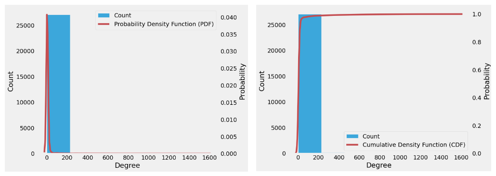

Thus, in order to try to carry out a more detailed analysis in relation to degree, the network nodes were filtered, so that a subgraph was built only with nodes of degree 100 or higher. It can be noticed that the histogram has already become more distributed, as seen in the plots below, and that approximately 60% of the nodes (among the nodes with degree greater than 100) have a degree in the range of 100-200.

  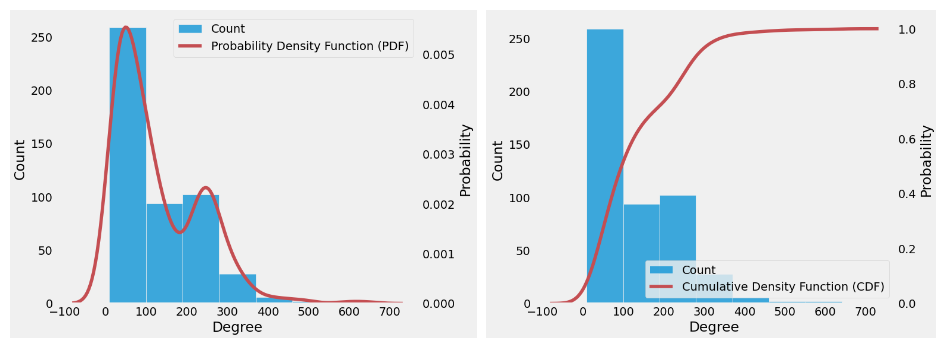

Similarly, the same analysis was performed for the closeness centraliy metric. It was not necessary to filter the graph, as in the previous case, since the data were already well distributed, with the highest occurrences 0.006 and 0.01, as seen in the figure below.

  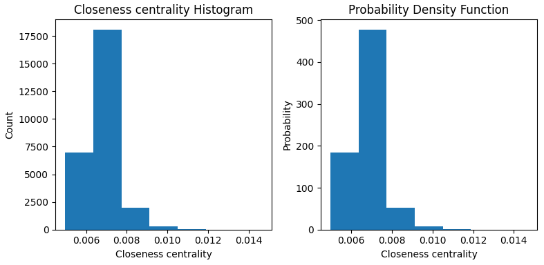

Then, plotting the histogram with the CDF and PDF functions, it is possible to see that approximately 90% of the network nodes have a closeness centrality value equal to or less than 0.008.

  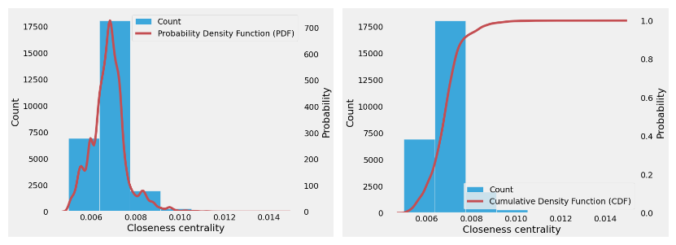

After that, it was made a plot which to compare the metrics. On the diagonal, it's possible to notice that the distributions have a long tail to the right side, with a positive symmetry, where many nodes have a small degree, unlike the eigenvector, in which few nodes have an important neighborhood. Also, the eigenvector and closeness have an exponencial trend, i. e., as one increases, the other increases as well. However, there is a limitation in this trend, in that after a certain point, this is no longer a valid thing.

  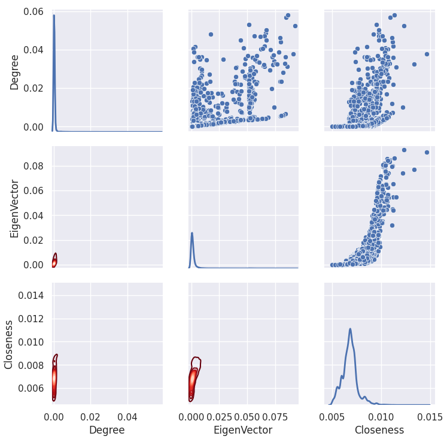

### Core Decomposition

Core decomposition is relacioned to the cores hierarchy, in which the nodes are deleted recursively in a network. For this, there are two metrics: k-core and k-shell. A k-core refers to a subnet in which all nodes have at least k neighbors. The nodes eliminated to reach a um k-core are called shell.

By analyzing the network, it was possible to see that it has 106 layers. Therefore, in the figure below it is possible see that the maximum k-core is 168, indicated with blue color, and the k-shell is 123, represented with red color.

  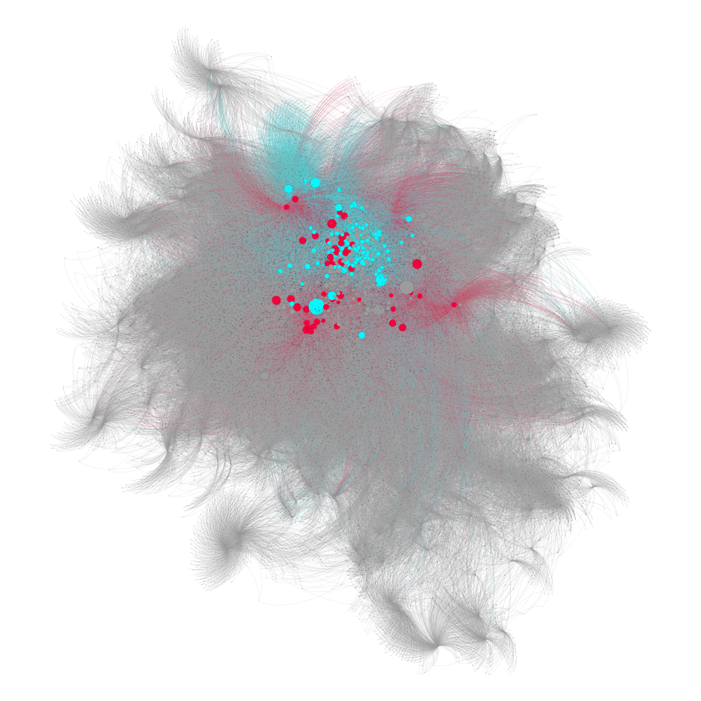

## References
[Ivanovitch's Repository](https://github.com/ivanovitchm/datastructure)

[Vladimir Batagelj and Matjaz Zaversnik. An o (m) algorithm for cores
decomposition of networks](https://arxiv.org/pdf/cs/0310049.pdf)