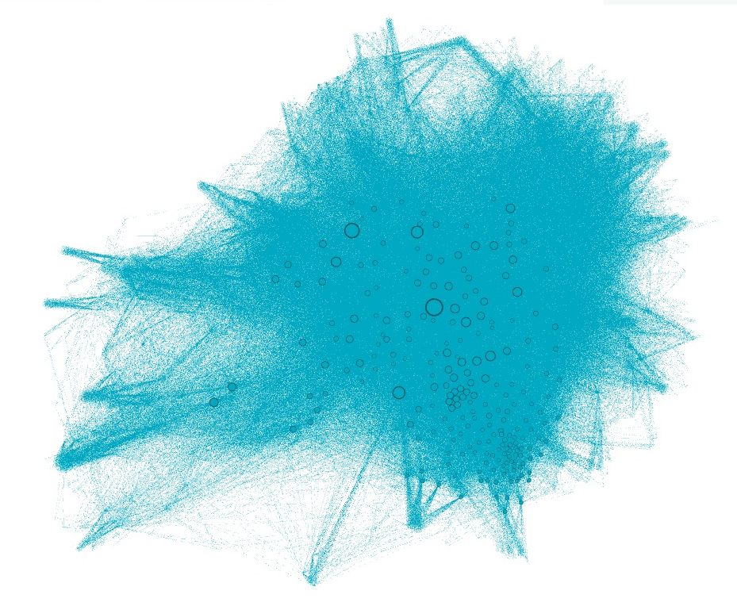
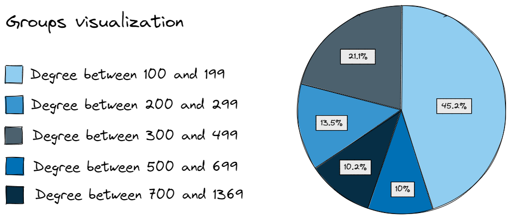

# FIFA World Cup 2022 - Network Visualization

This project aims to visualize a network built from Wikipedia page links. The construction and analysis of this network, using the `FIFA 2022 World Cup` wikipedia page as the initial node, has already been carried out previously, and can be seen at [this link](https://github.com/marianabritoazevedo/data-structure-ii/tree/main/network_with_wikipedia).

For the production of interactive network visualizations, the tools used were: [Gephi](https://gephi.org/), with the `SigmaExporter` plugin, [Retina](https://ouestware.gitlab.io/retina/beta/), a plugin of Gephi tool and [Gephisto](https://jacomyma.github.io/gephisto/). The productions of these tools will be explored separately for each tool.

It is worth mentioning that this work was done in a group, developed by [Mariana Azevedo](https://github.com/marianabritoazevedo), [Morsinaldo Medeiros](https://github.com/Morsinaldo) and [Thaís Medeiros](https://github.com/thaisaraujo2000).

## Visualization with Gephi and SigmaExporter

### Visualization 1: degree

Initially, it was thought to perform an interactive visualization based on the degree of the network nodes. For this, using the `pandas` library, the data was divided according to the degree into 5 different groups, as it shows below. More details about that data processing can be check in the notebook `Processing_data_gephi.ipynb`, and it is important to emphasize that this network was filtered and has nodes with step greater than or equal to 4.

*  Group 1: $4 \leq degree \leq 5 $
*  Group 2: $6 \leq degree \leq 7 $
*  Group 3: $8 \leq degree \leq 11 $
*  Group 4: $12 \leq degree \leq 20 $
*  Group 5: $21 \leq degree \leq 1369 $

After performing this division on the data, a new dataset was created, imported into gephi, and thus produced the final visualization. However, after doing all this process, the final view was not interesting, as can be seen in the image below. The nodes in group 5 (color blue), despite not being in greater numbers, are dominant in terms of the number of edges, producing a view that is difficult for the other groups to understand.

In this way, it was decided to make a second visualization referring to the degree of the network nodes, performing an even greater filtering to preserve only the nodes with a higher value referring to the degree.

### Visualization 2: degree (improved)

:information_source: Repository with more details [here](https://github.com/marianabritoazevedo/gephi-visualization-degree)

:mag_right: Interactive page [here](https://marianabritoazevedo.github.io/gephi-visualization-degree/network/)

To make a better visualization using the degree metric, a filtering was made in the network, keeping only the nodes with degree greater than or equal to 100, and thus, the final network had 460 nodes.

Then, using the `pandas` library, the data was divided according to the degree into 5 different groups. More details about that data processing can be check in the notebook `Processing_data_gephi.ipynb`.

*  Group 1: $100 \leq degree \leq 199 $
*  Group 2: $200 \leq degree \leq 299 $
*  Group 3: $300 \leq degree \leq 499 $
*  Group 4: $500 \leq degree \leq 699 $
*  Group 5: $700 \leq degree \leq 1369 $

After performing this division on the data, a new dataset was created, imported into gephi, and thus produced the final visualization. The image below shows the colors chosen to represent each group, as well as the percentage of each. It is noticed that almost half of the nodes in this network belong to the first group, with degrees between 100 and 199.

### Visualization 3: community

:information_source: Repository with more details [here](https://github.com/marianabritoazevedo/gephi-visualization-community)

:mag_right: Interactive page [here](https://marianabritoazevedo.github.io/gephi-visualization-community/network/)

To explore another metric, it was used another metric from Gephi tool. In the `statistics` tab of the gephi software, the `modularity` metric was chosen, within the `community detection` group, to detect communities in the final network. After this execution, 10 different communities were detected in the network.

With this information, the network was styled so that each community was painted in a different color, allowing easy identification, and then the final visualization was produced. The image below has a caption explaining which color is related to which community.

